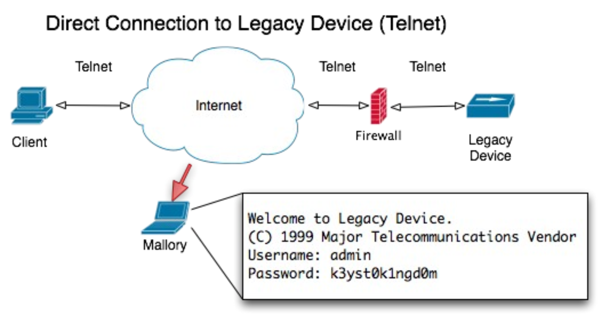

class: center, middle

# SSH - Secure SHell

---

## Agenda

--

1. What is it?

--

2. Why bother?

--

3. How does it work?

--

3. Configuration

--

4. Usage examples

---

## Preface

--

- my main takeaway from BSE so far:
  - we are different people... with different areas of knowledge (duh!)

--
- that was the main factor when choosing a topic
  - hopefully there's something interesting for everyone
  - and maybe even something useful as well!

--
- with that in mind:
  - don't hesitate to interrupt and ask if something is unclear

---
layout: true
.left-column[
  ## What is SSH?
]
---

--
.right-column[
### Well, RTFM! 😄

]

---
layout: true
.left-column[
  ## What is SSH?
  ### Overview
]
---

--
.right-column[
- "**S**ecure **SH**ell"
]

---
count: false
.right-column[
- "**S**ecure **SH**ell"
- network protocol
]

---
count: false
.right-column[
- "**S**ecure **SH**ell"
- network protocol
  
]

---
count: false
.right-column[
- "**S**ecure **SH**ell"
- network protocol
  
- _but, it's no application (and no shell!)_
]

---
count: false
.right-column[
- "**S**ecure **SH**ell"
- network protocol
  
- _but, it's no application (and no shell!)_
- client-server architecture
]

---
count: false
.right-column[
- "**S**ecure **SH**ell"
- network protocol
  
- _but, it's no application (and no shell!)_
- client-server architecture
- secures communication, not the messages
]

???
no replacement for anti-virus

---
layout: true
.left-column[
  ## What is SSH?
  ### Overview
  ### History
]
---

--
.right-column[
- SSH-1: initial version designed by Tatu Ylönen (1995)
  - Ylönen founded the SSH Communication Security

.center[]
]

???

Goal of SSH Communication Security was to market and develop SSH

---
count: false
.right-column[
- SSH-1: initial version designed by Tatu Ylönen (1995)
  - Ylönen founded the SSH Communication Security

.center[]
  - _not secure anymore!_
]

---
count: false
.right-column[
- SSH-1: initial version designed by Tatu Ylönen (1995)
  - Ylönen founded the SSH Communication Security

.center[]
  - _not secure anymore!_

- SSH-2: various improvements over SSH-1
  - released by SCS (1998)
  - incompatible to SSH-1
  - standardized by IETF: RFC 4251 (2006)
]

---

.right-column[
- intended to replace unsecured remote login protocols (`telnet`/`rlogin`/`rsh`/...)
]

--
.right-column[
- first free SSH implementation: `OpenSSH` (OpenBSD)
]

--
.right-column[
- new secure clients such as `scp`, `sftp`, ... replace unsecured ones like `rcp` or `ftp`
]

---
layout: true
.left-column[
  ## What is SSH?
  ## Why SSH?
]
---

--
.right-column[
- secure, encrypted communication channel
]

--
.right-column[
- guarantees message integrity
]

--
.right-column[
- uses little bandwidth
]

--
.right-column[
- user authentication
]

--
.right-column[
- ... and server authentication!
]
???
To be demonstrated later

--
.right-column[
- industry standard
]
???
Available on pretty much all platforms, mobile, browser

**Demo**: Show FireSSH plugin to login on raspi (using stored session)

---
.right-column[
- basically, it turns this...

]

---
count: false
.right-column[
- basically, it turns this...

- ... into this:


]

---
.right-column[
- run commands on remote systems
]
???
eg. set-ntp on FPUs

--
.right-column[
- remote system administration
]

--
.right-column[
- remote file transfer
]

--
.right-column[
- even transfer files between hosts that have no connection to each other!
  - `scp -3 host1:/file host2:/file2`
]
???
Other remote file transfer applications can't do that!

---
layout: true
.left-column[
  ## What is SSH?
  ## Why SSH?
  ## How to SSH?
  ### Connection
]
---

---
.right-column[
- server sends its public fingerprint
]

--
.right-column[
- up to the user to verify the server fingerprint:
  - get from sysadmin
  - initial connection from trusted network
  - hope it's ok
]

--
.right-column[
- establish encryption: session key negotiation (Diffie-Hellman)
]
???
Diffie-Hellman:
- both agree on large prime number and encryption generator (like AES)
- both generate secret prime number (private key) and generate public key with the private key, encryption generator and the shared prime number
- the public keys are exchanged
- both calculate the shared session key from the own private key, the other's public key, and the original shared prime number

--
.right-column[
- authenticate user
  - based on GSSAPI, host, **public key**, challenge-response, or _password_
]
???
Host-based: grant access if host is listed in `/etc/hosts.equiv` (or one of a few other files), the
username matches, and the key in `known_hosts` matches. This is inherently insecure.

Challenge-response: server sends Qq and expects response (eg. Bx or PAM).

---
layout: true
.left-column[
  ## What is SSH?
  ## Why SSH?
  ## How to SSH?
  ### Connection
  ### Risks
]
---

--
.right-column[
- any connection increases the attack surface
]

--
.right-column[
- brute-force attacks
  - popular usernames (May 2015)


]

---
count: false
.right-column[
- any connection increases the attack surface
]

.right-column[
- brute-force attacks
  - popular usernames (May 2015)
  - popular passwords (May 2015)


]

---

.right-column[
#### Measures
]

--
.right-column[
- disable password authentication
  - use SSH keys instead
  - (or at least use strong passwords)
]

--
.right-column[
- use non-standard port
  - no real security, but less noise
]

--
.right-column[
- block hosts with repeated failed logins
  - eg. [fail2ban](http://www.fail2ban.org/wiki/index.php/Main_Page)
]

---
layout: true
.left-column[
  ## What is SSH?
  ## Why SSH?
  ## How to SSH?
  ### Connection
  ### Risks
  ### Configuration
]
---

--
.right-column[
- user configuration
  - `~/.ssh/config`
]
???
**Demo**

`ssh [raspiuser]@[raspihost]` [Show user config] `ssh raspi`

Because already logged in, show login attempts on raspi (attack surface!):

`journalctl --unit=sshd -r --no-pager | grep -i invalid`

--
.right-column[
- system-wide configuration
  - `/etc/ssh/ssh_config`
  - `/etc/ssh/sshd_config`
]
???
Configure stuff like:
```
PasswordAuthentication, PubkeyAuthentication,
HostBased, ChallengeResponse, KeyboardInteractive
AllowGroups, AllowUsers, DenyGroups, DenyUsers
X11Forwarding
PermitTunnel
PermintUserEnvironment

Match user <username>
ForceCommand <command>
```

**Demo:** MatchUser and ForceCommand

Show `/etc/ssh/sshd_config` on raspi and login as `dummy` user

--
.right-column[
- keys
  - `~/.ssh/known_hosts`
  - `~/.ssh/authorized_keys`
  - `~/.ssh/id_rsa{,.pub}`
]
???
**Demo** `ssh -v raspi` (maybe), swap IP/key in `~/.ssh/known_hosts` and log in again

Permissions:
- `~/.ssh`: 700
- public keys: 644
- private keys: 600

---
layout: true
.left-column[
  ## What is SSH?
  ## Why SSH?
  ## How to SSH?
  ## SSH usage
]
---

--
.right-column[
#### From the manual:

`ssh  [-1246AaCfGgKkMNnqsTtVvXxYy]  [-b  bind_address]  [-c  cipher_spec]  [-D[bind_address  :]port] [-E log_file] [-e escape_char] [-F configfile] [-I pkcs11] [-i identity_file] [-J[user@]host[:port]] [-L address] [-l login_name] [-m mac_spec] [-O ctl_cmd] [-o option] [-p port] [-Q query_option] [-R address] [-S ctl_path] [-W host :port] [-w local_tun[:remote_tun]] [user@]hostname [command]`
]

---
layout: true
.left-column[
  ## What is SSH?
  ## Why SSH?
  ## How to SSH?
  ## SSH usage
  ### Basic usage
]
---
.right-column[.centered[
## `ssh host`
]]

---
count: false
.centered[
## `ssh user@host`
]

---
count: false
.centered[
## `ssh user@host COMMAND`
]

???
**Demo**:

`ls -alh`

---
count: false
.centered[
## `ssh -X user@host COMMAND`
]
???
**Demo**:

`xclock`

---
.right-column[
### Common options
- `-i identity_file`: specify key for authentication
- `-X`: enable X11 forwarding
- `-p port`: specify port on remote host
- `-C`: enable compression
- `-c cipher`: specify cipher
]
???
Compression uses `gzip` - recommended for slow networks only

Cipher has security and performance implications

---
layout: true
.left-column[
  ## What is SSH?
  ## Why SSH?
  ## How to SSH?
  ## SSH usage
  ### ~~Basic~~ usage
]
---

.right-column[
### Tunnelling
]

---
count: false
.right-column[
### Tunnelling
- secure insecure protocol
]

---
count: false
.right-column[
### Tunnelling
- secure insecure protocol
- make remote service appear local
]

---
count: false
.right-column[
### Tunnelling
- secure insecure protocol
- make remote service appear local
- some options:
  - `-L [address:]port:host:hostport`: forward connections to the local host to the remote host/port
  - `-f`: fork to background, recommended when using X11-forwarding
  - `-N`: no remote command execution
  - `-g`: allow remote hosts to connect to local forwarded ports
]
???
**Demo**: access localhost mongodb
```
ssh -f -N -L 12345:localhost:27017 hxm@cdaip
mongo localhost:12345/fatigue
```

Also: `-R` (reverse proxy), `-D`- (dynamic port forwarding)

Unix sockets can be forwarded as well

`-f`: implies `-n` (stdin > /dev/null)

`-N`: Useful when just wanting to forward ports

---
layout: true
.left-column[
  ## What is SSH?
  ## Why SSH?
  ## How to SSH?
  ## SSH usage
  ### Basic usage
  ### Environment/session control
]
---

--
.right-column[
- some interesting environment variables
  - `DISPLAY`: location of forwarded X11 server
  - `SSH_CONNECTION`: client and server of the connection (client IP, client port, server IP, server port)
]

--
.right-column[
- escape characters
  - `~.`: disconnect
  - `~^Z`: background session
  - `~#`: list forwarded connections
]


---
layout: true
.left-column[
  ## What is SSH?
  ## Why SSH?
  ## How to SSH?
  ## SSH usage
  ## More SSH
]
---

---
count: false
.right-column[
- [ssh-chat](https://github.com/shazow/ssh-chat)
  - built-in encryption
  - built-in authentication
  - user whitelisting
]
???
**Demo**: Log in on [chat.shazow.net](chat.shazow.net)

---
count: false
.right-column[
- [ssh-chat](https://github.com/shazow/ssh-chat)
  - built-in encryption
  - built-in authentication
  - user whitelisting
- [sshuttle](https://github.com/apenwarr/sshuttle)
  - "where transparent proxy meets VPN meets ssh"
]
???
**Demo**: Connect to raspi and access webservice

---
count: false
.right-column[
- [ssh-chat](https://github.com/shazow/ssh-chat)
  - built-in encryption
  - built-in authentication
  - user whitelisting
- [sshuttle](https://github.com/apenwarr/sshuttle)
  - "where transparent proxy meets VPN meets ssh"
- SSH RPC
  - `ssh api.example.com multiply 4 5`
]

---
count: false
.right-column[
- [ssh-chat](https://github.com/shazow/ssh-chat)
  - built-in encryption
  - built-in authentication
  - user whitelisting
- [sshuttle](https://github.com/apenwarr/sshuttle)
  - "where transparent proxy meets VPN meets ssh"
- SSH RPC
  - `ssh api.example.com multiply 4 5`
- SSH fileserver
  - `ssh static.example.com get \
    /images/header.png`
]

---
count: false
.right-column[
- [ssh-chat](https://github.com/shazow/ssh-chat)
  - built-in encryption
  - built-in authentication
  - user whitelisting
- [sshuttle](https://github.com/apenwarr/sshuttle)
  - "where transparent proxy meets VPN meets ssh"
- SSH RPC
  - `ssh api.example.com multiply 4 5`
- SSH fileserver
  - `ssh static.example.com get \
    /images/header.png`
- distributed multihead X-server
]
???
**Demo**:

xdmx!

---
count: false
.right-column[
- [ssh-chat](https://github.com/shazow/ssh-chat)
  - built-in encryption
  - built-in authentication
  - user whitelisting
- [sshuttle](https://github.com/apenwarr/sshuttle)
  - "where transparent proxy meets VPN meets ssh"
- SSH RPC
  - `ssh api.example.com multiply 4 5`
- SSH fileserver
  - `ssh static.example.com get \
    /images/header.png`
- distributed multihead X-server
- X streaming to TTY
]
???
**Demo**:

Run texttop on AL

---
layout: true
.left-column[
  ## What is SSH?
  ## Why SSH?
  ## How to SSH?
  ## SSH usage
  ## More SSH
  ## Outlook
]
---

--
.right-column[
- load balancing
]

--
.right-column[
- multiplexing
]

--
.right-column[
- VPN
]

--
.right-column[
- SSH agent
]

--
.right-column[
- other SSH-based utilities
]

--
.right-column[
- other clients
  - MoSH!
]

---
layout: true
---
#### Sources - information
```
https://medium.com/swlh/ssh-how-does-it-even-9e43586e4ffc
https://systemoverlord.com/projects/ssh_presentation
http://www.slideshare.net/shahhe/introduction-to-ssh
https://en.wikipedia.org/wiki/Secure_Shell
https://www.digitalocean.com/community/tutorials\
  /ssh-essentials-working-with-ssh-servers-clients-and-keys
http://dragonresearchgroup.org/insight/sshpwauth-cloud.html
http://www.ssh.com
http://www.openssh.org
https://en.wikibooks.org/wiki/OpenSSH
man ssh
man sshd
man xdmx
```

#### Sources - tools
```
https://github.com/shazow/ssh-chat
https://github.com/apenwarr/sshuttle
https://github.com/tombh/texttop
http://dmx.sourceforge.net/
https://github.com/gnab/remark
```

